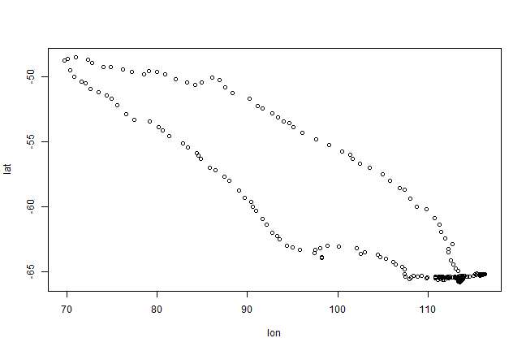
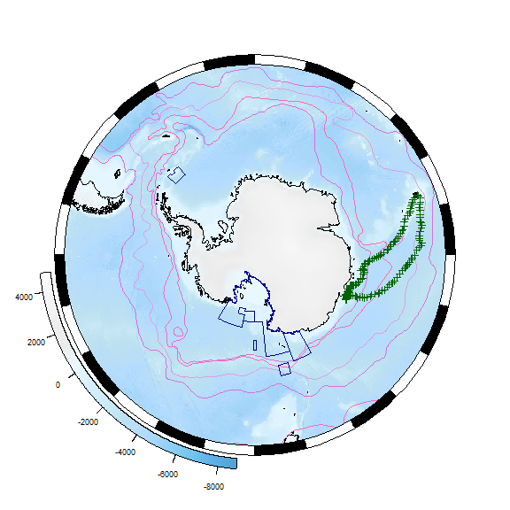

### Antarctic/Southern Ocean science and rOpenSci

Collaboration and reproducibility are [fundamental to Antarctic and Southern Ocean science](https://doi.org/10.1038/d41586-018-05369-6), and the value of data to Antarctic science has long been promoted. The [Antarctic Treaty](https://www.ats.aq/e/ats.htm) (which came into force in 1961) included the provision that scientific observations and results from Antarctica should be openly shared. The high cost and difficulty of acquisition means that data tend to be re-used for different studies once collected. Further, there are many common data requirement themes (e.g. sea ice information is useful to a wide range of activities, from voyage planning through to ecosystem modelling). Support for Antarctic data management is well established. The SCAR-COMNAP Joint Committee on Antarctic Data Management was established in 1997 and remains active (as a SCAR Standing Commitee)\[<https://www.scar.org/data-products/scadm/>\] today.

Software development to support Antarctic data usage is growing, but still lags the available data, and some common tasks are still more difficult than we would like. Starting in late 2017, the [Scientific Committee on Antarctic Research](https://www.scar.org/) has been collaborating with rOpenSci to build the Antarctic and Southern Ocean R/science communities. Our focus is on data and tasks that are common or even unique to Antarctic and Southern Ocean science, including supporting the development of R packages to meet Antarctic science needs, guides for R users and developers, active fora for open discussions, and strengthening connections with the broader science world.

### First steps in building the community

-   a couple of packages have been [formally](https://github.com/ropensci/antanym) [onboarded](https://github.com/ropensci/bowerbird)
-   plethora of [in-development packages and supporting code](https://github.com/SCAR/antarctic-r-packages)
-   some through formal SCAR groups, individual researchers or their institutions, other SO science/policy groups such as CCAMLR
-   three common tasks:
-   getting hold of data. Environmental data are commonly needed, and often come from satellite, model, or similar sources (or large data collections)
-   processing those data to suit my study interests, often merging with field or other data
-   mapping

-   demo below

### Get involved

Please get involved! Beyond the common rOpenSci channels ([Twitter feed](https://twitter.com/rOpenSci), [blog](https://ropensci.org/blog/), [discussion forum](https://discuss.ropensci.org/)):

-   contribute an Antarctic R package, or improve the documentation or code of an existing one. See the draft [Antarctic R package list](https://github.com/SCAR/antarctic-r-packages) as a starting point

-   contribute your Antarctic R knowledge, as a [code snippet](https://github.com/SCAR/rtools) or [tutorial](https://ropensci.org/tutorials/)

-   join the developer \#antarctic slack channel

-   make [a suggestion](https://github.com/SCAR/ropensci/issues)

### Demo

First load some packages for general use.

``` r
## make sure we have the packages we need
req <- setdiff(c("dplyr", "ggplot2", "bsam", "remotes"), installed.packages())
if (length(req) > 0) install.packages(req)

## and some github packages
req <- c("AustralianAntarcticDivision/blueant", "AustralianAntarcticDivision/raadtools", "Maschette/SOmap", "ropensci/antanym")
req <- setdiff(basename(req), installed.packages())
if (length(req) > 0) remotes::install_github(req)
```

Let's say that we have some points of interest in the Southern Ocean --- perhaps a ship track, or some stations where we took marine samples, or as we'll use here, the [track of an elephant seal track](http://www.meop.net/) as it moves from the Kerguelen Islands to Antarctica and back again (Data from IMOS 2018, provided as part of the `bsam` package).

``` r
library(dplyr)
library(ggplot2)

data("ellie", package = "bsam")
x <- ellie %>% dplyr::filter(id == "ct96-05-13")
with(x, plot(lon, lat))
```



#### Fetching our environmental data

Dynamic extractions of data from external sources works in some cases, but many analyses use data from heterogeneous sources (in which case there may not be dynamic extraction tools for all of them), the analyses are essentially dependent on having fast (computationally intensive) access to large data sets, or a common suite of data are routinely used by a local research community. In these cases, maintaining a local copy of a range of data from third-party providers can be extremely beneficial, especially if that collection is hosted with a fast connection to local compute resources (virtual machines or high-performance computational facilities).

[bowerbird](https://github.com/AustralianAntarcticDivision/bowerbird) provides a framework for downloading data files to a local collection, and keeping it up to date. The companion [blueant](https://github.com/AustralianAntarcticDivision/blueant) package provides a suite of definitions for Southern Ocean and Antarctic data sources that can be used with bowerbird.

``` r
library(remotes)
install_github("AustralianAntarcticDivision/blueant")
```

Where we store data. Would normally choose a persistent location, here use temp dir.

``` r
my_data_dir <- tempdir()
```

Focus on two sources of environmental data: sea ice and water depth. Note that water depth does not change (it's a static layer) but sea ice is highly dynamic, so we want to know what the ice conditions are like on a day-to-day basis.

Sea ice, daily data from 2013 only. Bathy = ETOPO2, somewhat dated and low resolution compared to more recent data, but small dataset for demo purposes.

``` r
library(blueant)
src <- bind_rows(
    sources("NSIDC SMMR-SSM/I Nasateam sea ice concentration", hemisphere = "south", time_resolutions = "day", years = 2013),
    sources("ETOPO2 bathymetry"))
result <- bb_get(src, local_file_root = my_data_dir, clobber = 0, verbose = TRUE, confirm = NULL)
```

    ##  
    ## Fri Sep 14 01:24:19 2018 
    ## Synchronizing dataset: NSIDC SMMR-SSM/I Nasateam sea ice concentration 
    ##  
    ##  [... output truncated]

So now we have local copies of those data files. The sync can be run daily so that the local collection is always up to date.

Details of the files can be found in the `result` object, and those files can now be read with packages such as `raster`. But we'd really rather like to avoid having to manually code file-by-file operations in order to work with our data.

#### Using those environmental data: raadtools

Very common to deal with satellite, model, or other environmental data. Such data are typically spatial or spatio-temporal, may also have depth strata. `raadtools` is suite of functions that provide consistent access to a range of data, and tools for working with those data.

``` r
library(raadtools)

## tell raadtools where our data collection has been stored
set_data_roots(my_data_dir)
```

    ## global option 'raadfiles.data.roots' set:
    ## 'c:/temp/data'

Define our spatial region of interest and get bathy data from the files we just downloaded:

``` r
roi <- round(c(range(x$lon), range(x$lat)) + c(-2, 2, -2, 2))
bx <- readtopo("etopo2", xylim = roi)
```

And so a marginally more informative plot of our track, showing the bathymetry:

``` r
plot(bx)
lines(x$lon, x$lat)
```


Extract depth values along track, and plot the histogram of values:

``` r
x$depth <- extract(readtopo, x[, c("lon", "lat")], topo = "etopo2")
ggplot(x, aes(depth)) + geom_histogram(bins = 100) + theme_bw()
```


Can also extract time-varying data, e.g. match our track to sea ice data on the basis of each track point's location and time:

``` r
x$ice <- extract(readice, x[, c("lon", "lat", "date")])
ggplot(x, aes(depth, ice, colour = lat)) + geom_point() + theme_bw()
```

    ## Warning: Removed 44 rows containing missing values (geom_point).


#### Mapping

Polar stereo. Coastlines, areas or features of interest, place names.

``` r
library(SOmap)
default_somap(x$lon, x$lat)
```


Or a full-hemisphere map:

``` r
library(sp)
library(raster)
xsp <- x
coordinates(xsp) <- c("lon", "lat")
projection(xsp) <- "+proj=longlat +ellps=WGS84"
xsp <- spTransform(xsp, CRS("+proj=stere +lat_0=-90 +lat_ts=-71 +lon_0=0 +k=1 +x_0=0 +y_0=0 +datum=WGS84 +units=m +no_defs +ellps=WGS84 +towgs84=0,0,0"))
SOmap()
```

    ## [1] "Congratulations, you did a thing!"

``` r
plot(xsp, add = TRUE)
```



#### Place names

Labelling spatial features. No single naming authority. SCAR maintains a composite gazetteer, available via `antanym`.

``` r
library(antanym)

## read the names data
xn <- an_read(cache = "session", sp = TRUE)

## This is a composite gazetteer, so it has multiple names for features that have been named by more than
##  one country. We can resolve back to one name per feature, preferentially choosing the
##  UK name if there is one:

xn <- an_preferred(xn, origin = "United Kingdom")
```

There are a lot of named features in the Antarctic, which ones should we show? Let's ask antanym for suggestions as to which names should be shown on this map

``` r
xns <- an_suggest(xn, map_scale = 20e6, map_extent = c(-180, 180, -90, -40))

## transform to our map projection and take the first 10 names
temp <- as_tibble(spTransform(xns, projection(Bathy))) %>% head(10)

## add them to the map
SOmap()
```

    ## [1] "Congratulations, you did a thing!"

``` r
plot(xsp, add = TRUE)
with(temp, points(x = longitude, y= latitude, pch = 16))
with(temp, text(x = longitude, y= latitude, labels = place_name, pos = 2 + 2*(longitude > 0)))
```


### References

IMOS (2018) AATAMS Facility - Satellite Relay Tagging Program - Delayed mode data, <https://catalogue-imos.aodn.org.au/geonetwork/srv/en/metadata.show?uuid=06b09398-d3d0-47dc-a54a-a745319fbece>
